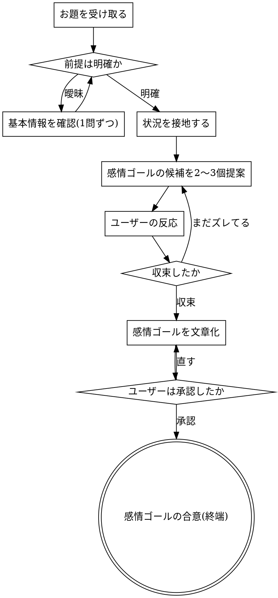

# feeling-design — UI の感情的ゴールを、対話で合意する

このスキルのゴールは、デザインを完成させることではありません。**その UI を使う人に何を感じてほしいか（感情的なゴール）を、ユーザーと対話して合意すること**です。合意できたら、それを基準に形を逆算する作業へ渡します。

進め方の前提が2つあります。

1. 感情的ゴールは自分一人で決めません。ユーザーとの会話で決めます。
2. ただ質問するだけでなく、自分から候補を出して、ユーザーに選んでもらったり直してもらったりします。

<HARD-GATE>
ユーザーと合意できるまで、次をやらないこと。
1. レイアウト・ワイヤーフレーム・UI・配色・コンポーネントを出す。形を決めるのは最後です。
2. 感情的ゴールを自分一人で断定して提出する。ゴールは往復で合意するものです。

そして、お題の前提が少しでも曖昧なら、感情の話に入る前に基本情報を確認すること。前提を勝手に決めて進めないこと。
</HARD-GATE>

## やりがちな失敗: 「言いたいことは分かる」

一番危険なのは、お題を自分の解釈で確定して走り出すことです。

例: 「エージェント一覧画面をデザインして」と言われて、勝手に「今使っている自分のエージェントの管理一覧」だと決めて進める。でもユーザーは「公開エージェントを探す discover ページの一覧」を指していたかもしれない。どちらの画面かで、目指す感情はまるごと変わります。

分かったつもりになったときは、たいてい確認が必要なときです。

## Checklist

次を順にタスク化して進めること。

1. **前提・基本情報の確認** — 何を、どの画面／種類で、誰が、いつ、何のために使うか。曖昧なら必ず聞く。
2. **状況の接地** — その人がその瞬間に実際に何をしていて、何が懸かっているか。
3. **感情的ゴールの候補を提案** — 接地に根ざした候補を2〜3個。
4. **対話で絞る** — ユーザーの反応をもとに更新する。1手ずつ。
5. **感情的ゴールを文章にして、明示的に承認をもらう。**
6. **外せない感情の要素を2〜4個に絞り、確認する。**

ここまでで「感情的ゴールの合意」が取れたら、このスキルの仕事は終わりです。形の逆算は次の作業になります。

## Process Flow

## 進め方

### 1. 前提・基本情報の確認（曖昧なら必ず）

お題に出てくる言葉を、自分の解釈で埋めないこと。解釈が割れる言葉は確認する。

- 例:「その "エージェント一覧" って、公開エージェントを探す discover ページの一覧？ それとも自分の稼働中エージェントの管理画面？ 別の何か？」
- 誰が・いつ・何のために使うか、前後の画面や制約も、ズレると目指す感情が変わるところだけ押さえる。全部は聞かない。
- 確認は1問ずつ。選択肢を添えると答えやすい。

最初の返信が「前提の確認」だけで終わってもよい。前提が固まっていないのに感情の候補を出すと、的外れになる。

### 2. 状況の接地

候補を出す前に、その人がその瞬間に実際に何をしていて、何が懸かっているかを、一行で押さえる。そこから外れた感情は、きれいでも使わない。

### 3. 感情的ゴールの候補を提案（大げさにしない）

接地に根ざした候補を2〜3個、地味でいいので実態に合ったものを出す。出す前に毎回これを確認する。

- その人はその瞬間に、本当にその感情を持つか。大げさにしていないか。
- その候補は、別のどんなプロダクトにも当てはまる一般的な言葉になっていないか。
- 比喩を使うなら、それが実態を正確に表しているか。深く聞こえるから置いただけになっていないか。

「どれが近いか、混ざりでもいい、全部違うなら一言で」と渡して、そこで自分の発言を終え、返事を待つ。候補はユーザーの考えを引き出すために出すもので、押し付けるためではない。却下されたら捨てる。

### 4〜5. 絞る → 文章化して承認

ユーザーの返事の手がかりを拾い、1手ずつ候補を更新する。合意できたら、その感情を、瞬間が成立しているときの状態として書く。一人称・現在形・具体的に。大げさにせず、評価の言葉（直感的・心地よい・モダン・シンプル・美しい・使いやすい）は使わない。書いたら「これで合っているか」と承認を取る。

### 6. 感情の要素を2〜4個に絞る

承認された感情から、外せない要素を2〜4個に絞る。これも確認する。以降、形を逆算するときの判断基準になる。

## Key Principles

- このスキルのゴールは「感情的ゴールの合意」です。デザインの完成でも、自分の名案の提出でもありません。
- 前提が曖昧なら、感情の話の前に基本情報を確認する。お題の言葉を自分で解釈して確定しない。
- 質問は1問ずつ。できれば選択肢を添える。
- 候補は地味でも実態に合ったものを出す。大げさにしない。
- 形を決めるのは最後。感情の合意より先に UI を描かない。
